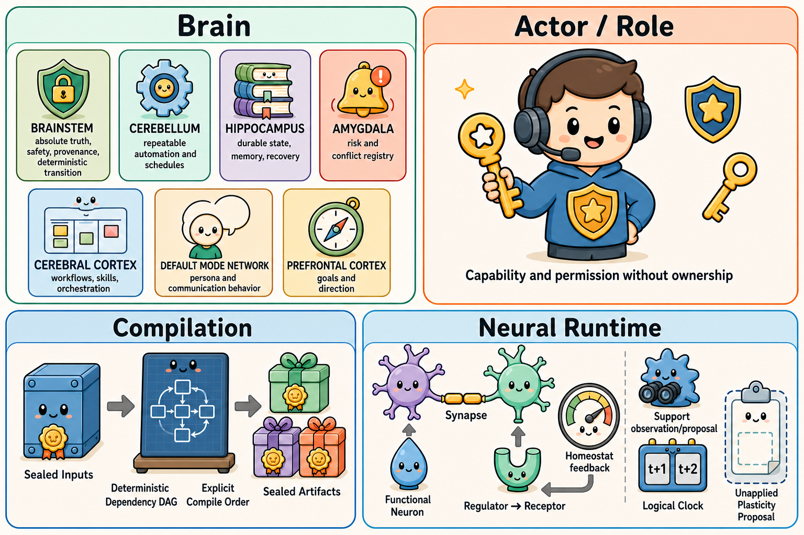
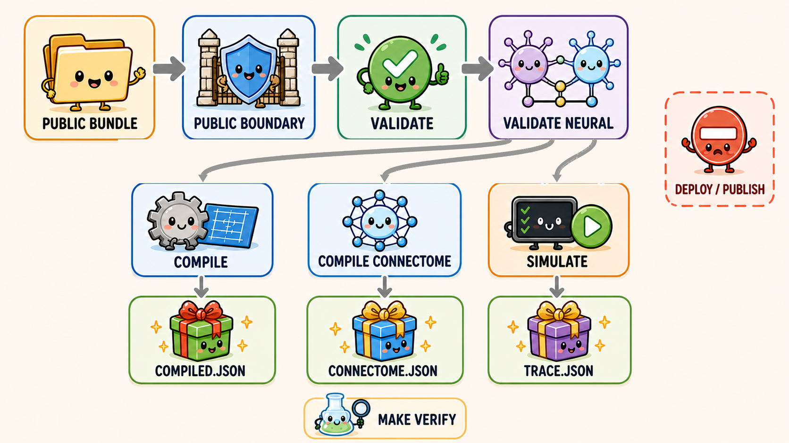

<!-- locales: README.md README.ko.md README.zh-CN.md README.es.md README.ja.md -->

# Brain-Role Architecture

**English** | [한국어](README.ko.md) | [简体中文](README.zh-CN.md) | [Español](README.es.md) | [日本語](README.ja.md)

[](https://github.com/JeremyDev87/Brain-Role-Architecture/actions/workflows/verify.yml)
[](pyproject.toml)
[](LICENSE)

**PRE_RELEASE · source candidate 0.2.0 · not published**

Brain-Role Architecture is a verifiable, role-aware architecture for governing AI-agent invariants,
durable state, risk, workflows, persona, and goals without confusing responsibility with execution order.

> **One rule survives every rewrite:** P0 is the only absolute invariant. P1-P6 can change only through
> explicit ownership, approval, provenance, rollback, and effective-time contracts.



*P6 has another brilliant new direction. P0 has heard this before.*

## Why this exists

Agent systems often mix safety rules, memory, workflows, persona, and goals into one mutable prompt or
configuration. That makes it difficult to answer basic governance questions: What may change? Who owns the
change? What depends on it? Can it be rolled back? Brain-Role Architecture makes those boundaries explicit,
machine-checkable, and portable.

The README explains the project; [SPEC.md](SPEC.md) remains the normative contract and takes precedence over
all explanatory documentation.

## Responsibility topology: P0-P6

| Layer | Responsibility | Change contract |
| --- | --- | --- |
| **P0** | Truth/non-fabrication, safety/security, provenance/no-loss, deterministic transition | **Absolute invariant.** No higher layer or role may override it. |
| **P1** | Repeatable automation and schedules | Controlled; may be reserved. |
| **P2** | Durable state and memory | Controlled with explicit ownership and provenance. |
| **P3** | Risk and conflict registry | Controlled; may be reserved. |
| **P4** | Workflows and orchestration | Controlled, reviewable, and reversible. |
| **P5** | Persona and communication behavior | Controlled with explicit change-control metadata. |
| **P6** | Goals and direction | Controlled with explicit change-control metadata. |

P numbers describe **responsibility and authority**, not runtime or compile order.

## Three independent planes

1. **Brain plane** — responsibility, authority, and change rules.
2. **Actor/Role plane** — capabilities, inputs/outputs, permissions, state scope, and escalation.
3. **Compilation plane** — an explicit dependency DAG and explicit compile order, independent of P numbers.

Keeping these planes separate prevents a role from gaining authority merely because it runs first or last.
See [the three-plane explanation](docs/explanation/three-planes.md).

## Architecture at a glance


*P0-P6 define responsibility; Actor/Role defines capability; the Compilation plane defines explicit transformation order.*

The additive 0.2.x neural extension is orthogonal to all three: typed Functional Neurons and Synapses carry
execution signals, while explicit receptors, homeostats, support contracts, and logical clocks provide bounded
modulation. None of activation, strength, concentration, receptor count, or graph centrality creates authority.

## What is included

- Normative specification and Draft 2020-12 JSON Schemas
- Deterministic, offline `brain-role` validator CLI
- Deterministic `CompiledConnectome` compiler and bounded offline neural simulator
- Receptor-bounded regulation, homeostasis, support, logical-clock, and proposal-only plasticity contracts
- Synthetic valid and invalid conformance fixtures
- Read-only Hermes `prefill_messages_file` reference exporter
- Public/private boundary checks and a threat model
- Unit, schema-sync, documentation, and distribution smoke verification

## Quick start

Requirements: Python 3.11+ and [`uv`](https://docs.astral.sh/uv/).

```bash
git clone https://github.com/JeremyDev87/Brain-Role-Architecture.git
cd Brain-Role-Architecture
uv sync --all-groups
uv run brain-role validate examples/minimal-public --format json
```

Expected result:

```json
{"errors":[],"specVersion":"0.1.0","valid":true}
```

Compile a deterministic neutral bundle, render a Hermes reference bundle, and run every repository gate:

```bash
uv run brain-role compile examples/minimal-public --output .artifacts/compiled.json
uv run brain-role render hermes examples/minimal-public --output .artifacts/hermes
uv run brain-role validate-neural examples/neuroendocrine-public
uv run brain-role compile-connectome examples/neuroendocrine-public --output .artifacts/connectome.json
uv run brain-role simulate .artifacts/connectome.json \
  --scenario examples/neuroendocrine-public/scenario.yaml --output .artifacts/trace.json
make verify
```

## Validation and artifact flow



*Validation produces inspectable artifacts; it does not activate Hermes, deploy, publish, or change a runtime home.*

`compile` writes a canonical JSON file with explicit layer order and stable role/policy ordering. It adds no
source paths, credentials, or runtime activation data.

`render hermes` writes only beneath the selected output directory. It does **not** activate Hermes, change
configuration, or touch `SOUL.md`, `USER.md`, `MEMORY.md`, or `~/.hermes`.

## Use it for

- Designing auditable AI-agent governance bundles
- Validating layer ownership, dependency, and permission contracts in CI
- Testing adapters against deterministic synthetic fixtures
- Reviewing persona and goal changes under their declared change-control contracts

## It is not

- A hosted agent runtime or orchestration service
- A self-modifying memory system
- Authorization to deploy, publish, activate, or mutate a live Hermes installation
- A container for real profiles, sessions, credentials, private URLs, or personal data

## Documentation map

- [Normative specification](SPEC.md)
- [Quick-start tutorial](docs/tutorials/quickstart.md)
- [Three independent planes](docs/explanation/three-planes.md)
- [CLI reference](docs/reference/cli.md)
- [Neural runtime reference](docs/reference/neural-runtime.md)
- [Neural runtime authority decision](docs/adr/0006-neural-runtime-orthogonal-planes.md)
- [Manifest and schema model](docs/reference/manifest-model.md)
- [Threat model](docs/security/threat-model.md)
- [Contributing](CONTRIBUTING.md) and [governance](GOVERNANCE.md)

## Security and public/private boundary

Public bundles must contain only synthetic `PUBLIC` material. Do not add credentials, private URLs, real
profiles or sessions, secret values, account identifiers, or personal absolute paths. Report vulnerabilities
through [SECURITY.md](SECURITY.md), not a public issue.

The validator is offline, deterministic, and side-effect-free. Validation errors use instance-relative paths
and must not echo private absolute paths or secret values.

## Project status

Version `0.2.0` is an experimental source candidate. It is not represented as a package on a registry, a Git
tag, a GitHub Release, or a deployment. Compatibility may change while the specification remains pre-release.
See [CHANGELOG.md](CHANGELOG.md).

## Contributing

Start with [CONTRIBUTING.md](CONTRIBUTING.md) and [CODE_OF_CONDUCT.md](CODE_OF_CONDUCT.md). Changes that alter
behavior must preserve the normative contract, add synthetic regression evidence, and pass:

```bash
make verify
```

## Publication boundary

Passing validation or `make verify` does **not** authorize a Git commit, push, release, package publication,
deployment, activation, or repository visibility change. Those are separate owner-controlled decisions.

Licensed under Apache-2.0. See [LICENSE](LICENSE) and [NOTICE](NOTICE).
